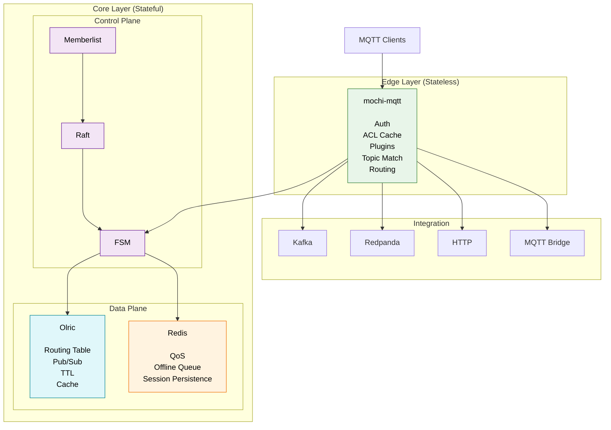
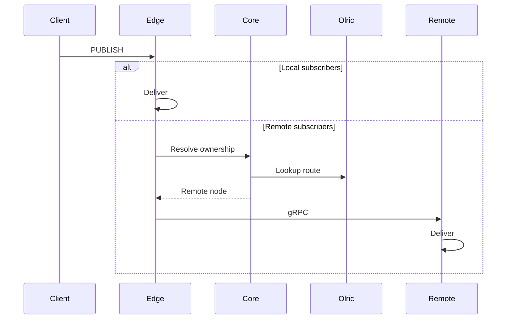
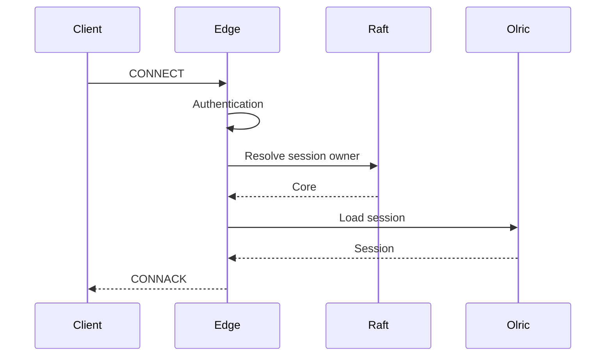
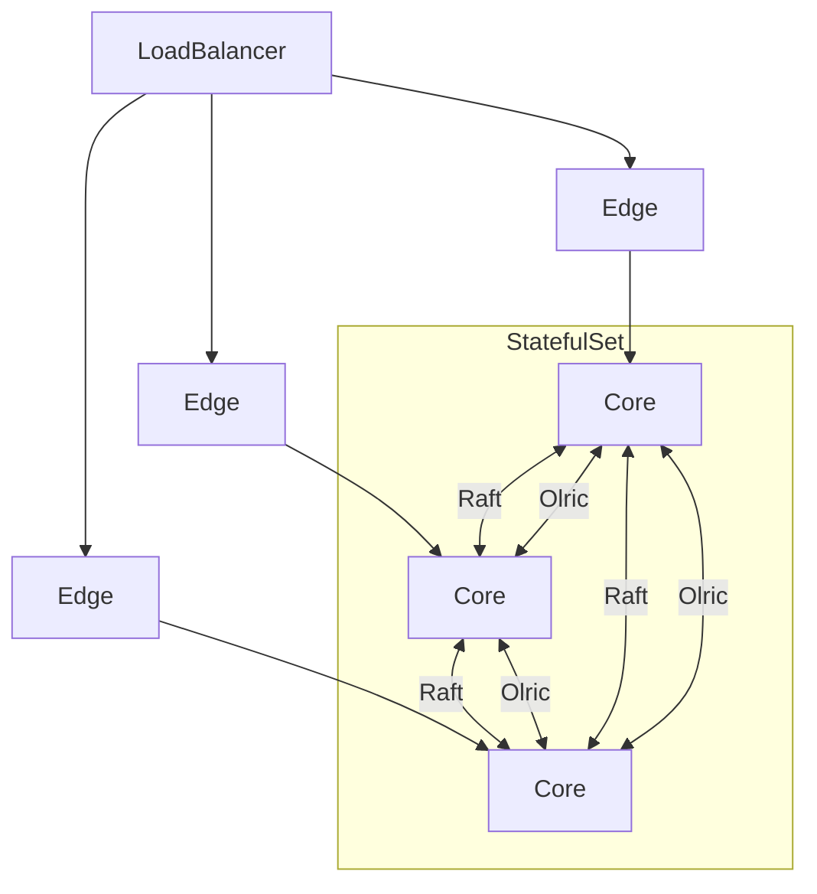

# Keel MQTT

A **cloud-native clustered MQTT broker** written in Go, built on
[`mochi-mqtt`](https://github.com/mochi-mqtt/server).

Keel is designed as a simpler alternative to VerneMQ and EMQX for teams that
need horizontal scalability without adopting a symmetric CRDT-based cluster
or a BSL-licensed broker.

Instead of making every node equal, Keel separates the cluster into:

- **Stateless MQTT Edge nodes**
- **Strongly-consistent Core nodes**
- **Distributed routing and cache**
- **Direct data plane**

---

## Highlights

- MQTT 3.1.1 / MQTT 5
- Stateless edge nodes
- Strongly consistent control plane (Raft)
- Distributed routing with Olric
- Kubernetes-first architecture
- Plugin pipeline
- Kafka / Redpanda / HTTP bridge
- Single binary (`--role=edge`, `core`, `combined`)
- Apache 2.0

---

# High-Level Architecture



---

# Why not VerneMQ or EMQX?

- **VerneMQ** clusters nodes symmetrically using CRDTs (`vmq_swc`), which can
  produce non-deterministic merges under heavy subscribe/unsubscribe churn and
  offers no clean separation between "pod ready" and "cluster ready".

- **EMQX** moved to **BSL 1.1** from v5.9.0.

Keel adopts the same architectural direction taken by modern distributed
systems:

- Core nodes (stateful)
- Stateless edge nodes
- Strongly consistent metadata
- Independent data plane

Similar concepts can be found in:

- EMQX (Mria Core/Replicant)
- RabbitMQ (Quorum Queues)
- NATS JetStream
- Redpanda

---

# Architecture

Keel separates responsibilities into independent layers.

| Layer | Responsibility | Technology |
|--------|---------------|------------|
| Transport | MQTT protocol | mochi-mqtt |
| Broker | Auth, ACL, plugins, routing | Internal |
| Control Plane | Cluster metadata | Raft + Memberlist |
| Data Plane | Routing table, cache, pub/sub | Olric |
| Persistence | QoS persistence, offline queue | Redis |
| Integration | Kafka, HTTP, MQTT bridge | Internal |

---

## Node roles

| | Core | Edge |
|------|------|------|
| MQTT Listener | Optional | ✔ |
| Raft | ✔ | ✖ |
| Memberlist | ✔ | ✔ |
| Olric | ✔ | ✖ |
| Redis | ✔ | ✖ |
| State | ✔ | ✖ |
| Kubernetes | StatefulSet | Deployment |

---

## Publish path



---

## Connect path



---

## Data ownership

Raft stores only **cluster metadata**:

- Session ownership
- Cluster configuration
- ACL version
- Redis primary election

Olric stores only **derivable state**:

- Routing table
- Topic registry
- Distributed cache
- TTL
- Pub/Sub

Redis stores only **durable MQTT state**:

- QoS persistence
- Offline queue
- Session persistence

No MQTT payload is replicated through Raft.

No MQTT packet is routed through Olric.

The MQTT data plane is always **direct gRPC** between broker nodes.

---

## Kubernetes deployment



---

## Quick start

Requires Docker and Docker Compose.

```sh
docker compose up -d --build
```

The default topology starts a **combined** cluster (Core + Broker in the same
process) suitable for development.

For production-like deployments (Core / Edge split), see:

- `deploy/docker-compose/README.md`
- `docker-compose.core-edge-split.yml`
- `docker-compose.tls.yml`

---

## Documentation

See:

- `keel-design-doc.md`
- `CONTRIBUTING.md`

---

## License

Apache License 2.0
