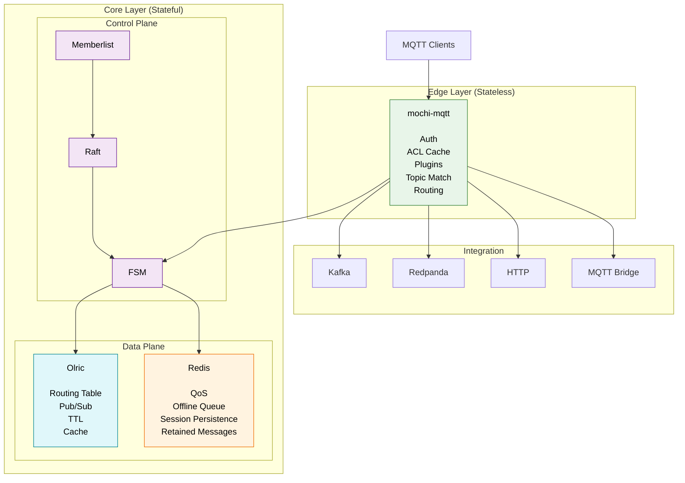
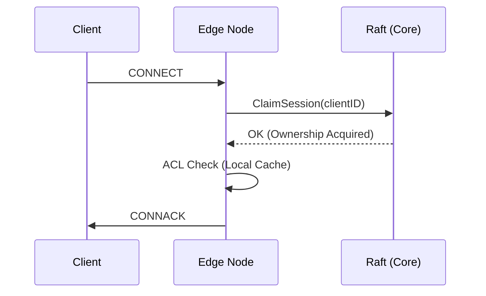
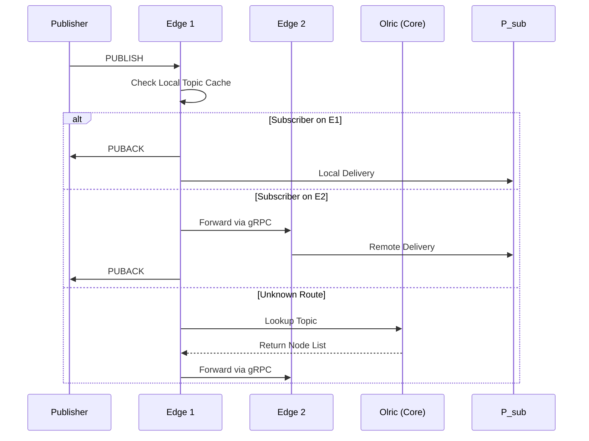
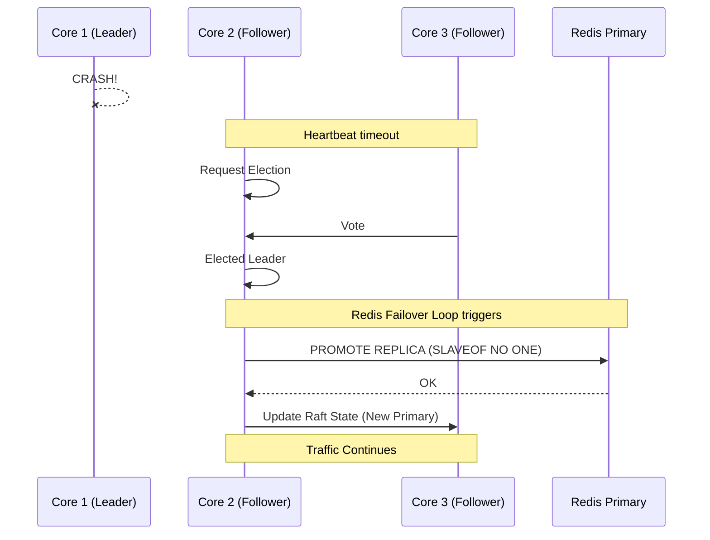
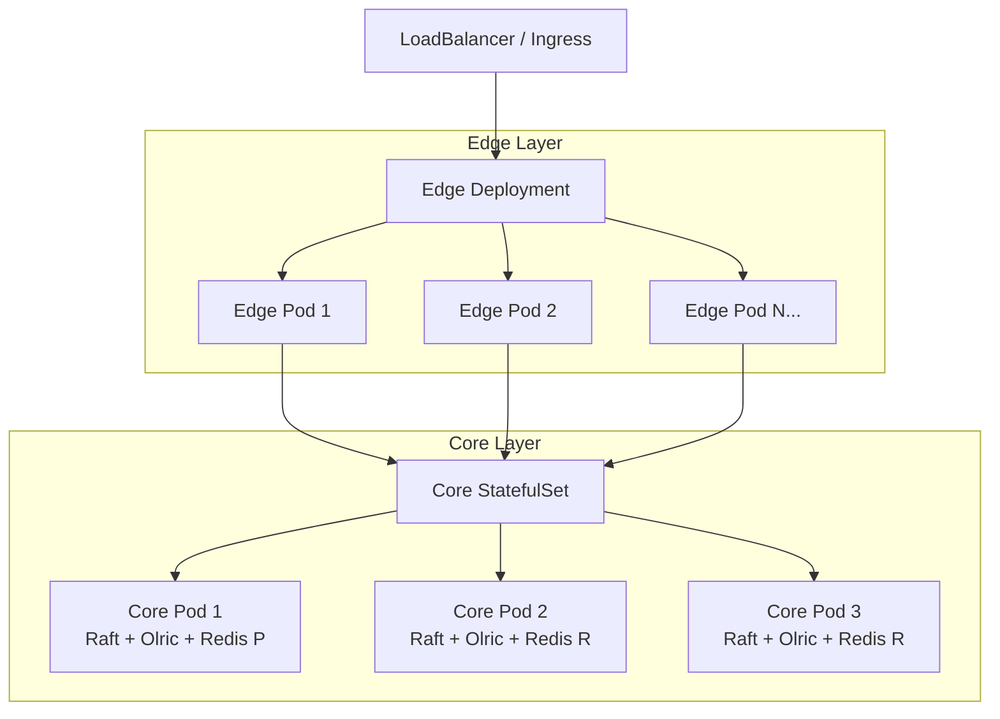

# Keel MQTT Gateway

A **cloud-native clustered MQTT broker** written in Go, built on
[`mochi-mqtt`](https://github.com/mochi-mqtt/server).

Keel is designed as a simpler alternative to VerneMQ and EMQX for teams that
need horizontal scalability without adopting a symmetric CRDT-based cluster
or a BSL-licensed broker.

Instead of making every node equal, Keel separates the cluster into:

- **Stateless MQTT Edge nodes** (HPA-scalable, terminate client connections)
- **Strongly-consistent Core nodes** (StatefulSet, manage cluster metadata via Raft)
- **AP Distributed routing** (Olric)
- **Direct gRPC data plane** (Zero message payload replication through consensus)

---

## Highlights

- **MQTT 3.1.1 / MQTT 5** support
- **Core/Edge Architecture:** Strongly consistent control plane (Raft) + eventually consistent data plane (Olric)
- **Auth:** per-tenant password, mTLS (X.509 CN + trusted CA pool), and JWT/JWKS (any OIDC-compliant IdP) — credential storage backends (postgres/file) are a fixed set today, no staged plugin interface yet. Two companion device-side agents cover the two real-world tiers: [`keel-cert-manager`](../keel-cert-manager) (Clavex Device PKI, full certificate rotation + revocation) and [`keel-jwt-agent`](../keel-jwt-agent) (generic OAuth2 client-credentials, no real revocation beyond token TTL)
- **Zero-Loss QoS 1/2:** Co-located Redis (primary+replica) with automatic Raft-driven failover
- **Kubernetes-first:** StatefulSet for Core, Deployment + HPA for Edge
- **Output plugin architecture:** Publish → Transform → Forward runs out-of-process (`hashicorp/go-plugin`/gRPC sidecar), fully isolated from MQTT delivery
- **Bridging:** Kafka / Redpanda / HTTP bridge out-of-the-box
- **Observability:** Prometheus metrics + OpenTelemetry tracing, tenant-aware sampling
- **Single binary:** (`--role=edge`, `core`, `combined`)
- **Apache 2.0 License** (No BSL, no SSPL)

---

## High-Level Architecture



---

## Why not VerneMQ or EMQX?

- **VerneMQ** clusters nodes symmetrically using CRDTs (`vmq_swc`), which can
  produce non-deterministic merges under heavy subscribe/unsubscribe churn and
  offers no clean separation between "pod ready" and "cluster ready".

- **EMQX** moved to **BSL 1.1** from v5.9.0, limiting free commercial usage.

Keel adopts the same architectural direction taken by modern distributed
systems (EMQX Mria Core/Replicant, RabbitMQ Quorum Queues, NATS JetStream):
- Core nodes (stateful) for cluster metadata
- Stateless edge nodes for connection termination
- Strongly consistent metadata, independent AP data plane

---

## Architecture Details

Keel separates responsibilities into independent layers to avoid bottlenecks on the hot path.

| Layer | Responsibility | Technology |
|--------|---------------|------------|
| Transport | MQTT protocol | mochi-mqtt |
| Broker | Auth, ACL, plugins, routing | Internal |
| Control Plane | Cluster metadata (Session Ownership, Redis Primary) | Raft + Memberlist |
| Data Plane | Routing table, cache, pub/sub | Olric |
| Persistence | QoS persistence, offline queue, retained | Redis |
| Integration | Kafka, HTTP, MQTT bridge | Internal |

### Data Ownership

- **Raft stores only cluster metadata:** Session ownership, cluster configuration, ACL version, Redis primary election.
- **Olric stores only derivable state:** Routing table, topic registry, distributed cache, TTL.
- **Redis stores only durable MQTT state:** QoS persistence, offline queue, session persistence, retained messages.

No MQTT payload is replicated through Raft. No MQTT packet is routed through Olric. The MQTT data plane is always **direct gRPC** between broker nodes.

---

## Node roles

| | Core | Edge |
|------|------|------|
| MQTT Listener | Optional | ✔ |
| Raft | ✔ | ✖ |
| Memberlist | ✔ | ✔ |
| Olric | ✔ | ✖ |
| Redis | ✔ | ✖ |
| State | ✔ | ✖ |
| Kubernetes | StatefulSet | Deployment + HPA |

---

## Data Flows

### 1. CONNECT sequence

When a client connects, the edge node claims the session via Raft to guarantee global uniqueness.



### 2. PUBLISH sequence

Messages are routed directly between edge nodes using a local cache, falling back to Olric only when necessary.



### 3. FAILOVER sequence

If a core node crashes, Raft elects a new leader and Redis is promoted to avoid QoS data loss.



---

## Kubernetes Deployment



---

## Observability

- **Metrics:** Prometheus exposed on `/metrics` (`cfg.MetricsAddr`) — connections, auth duration, message throughput, raft apply duration, forwarder drops, and more (`internal/telemetry/metrics.go`).
- **Tracing:** OpenTelemetry via OTLP/gRPC, enabled by setting `OTLP_ENDPOINT`. Sampling is 10% by default, with per-tenant opt-in to 100% (`tracing_enabled` in tenant gateway config). Spans cover connection auth, publish, raft apply, and forwarder retries (`internal/telemetry/tracing.go`).

---

## Quick start

Requires Docker and Docker Compose.

```sh
docker compose up -d --build
```

The default topology starts a **combined** cluster (Core + Broker in the same
process) suitable for development.

### Test it in 30 seconds

Open two terminals to test pub/sub:

**Terminal 1 (Subscriber):**
```sh
mosquitto_sub -h localhost -p 1883 -t "test/topic" -v
```

**Terminal 2 (Publisher):**
```sh
mosquitto_pub -h localhost -p 1883 -t "test/topic" -m "Hello Keel!"
```

For production-like deployments (Core / Edge split, TLS, Redis failover), see:
- `deploy/docker-compose/README.md`
- `docker-compose.core-edge-split.yml`
- `docker-compose.tls.yml`

---

## Status & Roadmap

Keel is currently production-ready for its core feature set.

**Validated:**
- Reconnect storms (tested up to 10,000 devices, 0 message loss on QoS 1/2)
- Redis failover (Split-brain prevention, 0 lost messages on primary crash)
- JWKS auto-fetch and key rotation
- Core/edge pod kills (leader failover, edge pod restart) on a real K8s cluster
- MQTT 5.0 Shared Subscriptions (`$share/group/topic`), exactly-once delivery per group across the whole cluster
- Output plugin isolation: a slow/failing Kafka-Redpanda producer can no longer block MQTT delivery (fixed 2026-07-31, see design doc)
- StatefulSet rolling update (Olric cold-start sequencing) — `/readyz` (TLS, Redis, raft leader, local Olric reachability, present since v0.2.3) has been through several real rolling updates on GKE (v0.2.0 → v0.2.5) with no issues observed
- HPA edge load metric end-to-end on GKE: `prometheus-adapter` (VictoriaMetrics-backed) registering `custom.metrics.k8s.io`, HPA reading real `keel_edge_load_score` values (`ScalingActive: True`, `ValidMetricFound`) — confirmed on Kimera 2026-08-03

**Roadmap / Known Gaps:**
- Auth/ACL staged plugin interface (JWT/OAuth/other providers today require code changes, not a plugin) — deliberately deferred
- Advanced K8s Operator for automated cluster scaling.

---

## Documentation

See:
- `CONTRIBUTING.md`

---

## License

Apache License 2.0
