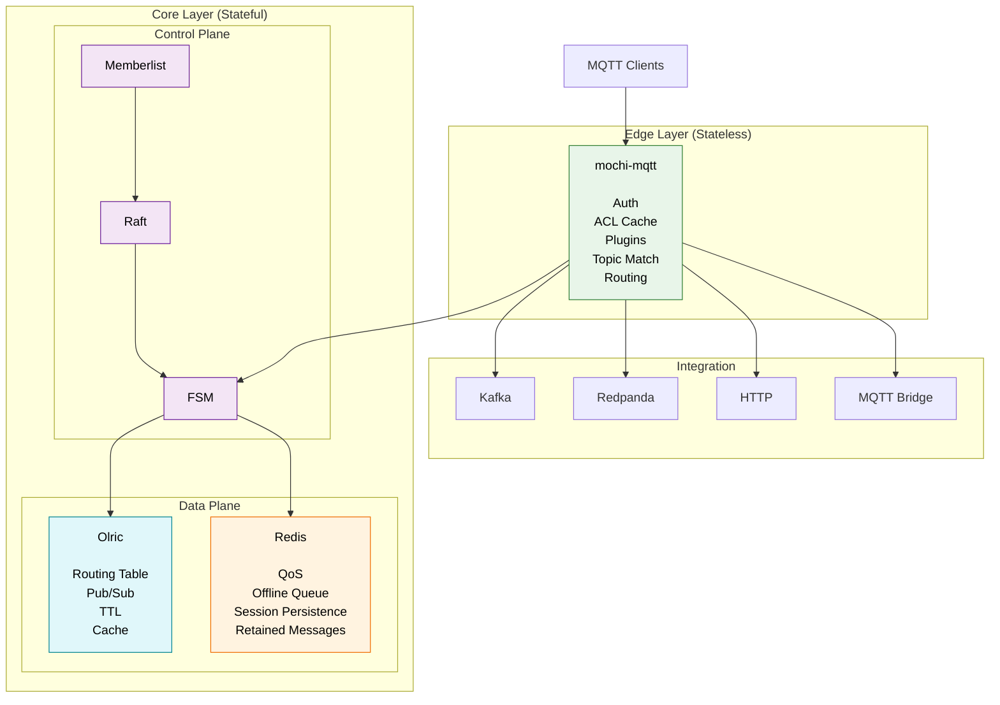

# Keel MQTT

A **cloud-native clustered MQTT broker** written in Go, built on
[`mochi-mqtt`](https://github.com/mochi-mqtt/server).

Keel is designed as a simpler alternative to VerneMQ and EMQX for teams that
need horizontal scalability without adopting a symmetric CRDT-based cluster
or a BSL-licensed broker.

Instead of making every node equal, Keel separates the cluster into:

- **Stateless MQTT Edge nodes** (HPA-scalable, terminate client connections)
- **Strongly-consistent Core nodes** (StatefulSet, manage cluster metadata via Raft)
- **AP Distributed routing** (Olric)
- **Direct gRPC data plane** (Zero message payload replication through consensus)

---

## Highlights

- **MQTT 3.1.1 / MQTT 5** support
- **Core/Edge Architecture:** Strongly consistent control plane (Raft) + eventually consistent data plane (Olric)
- **Zero-Trust Auth Pipeline:** Pluggable Auth with JWT/JWKS support (OIDC/Clavex-ready) and file/postgres backends
- **Zero-Loss QoS 1/2:** Co-located Redis (primary+replica) with automatic Raft-driven failover
- **Kubernetes-first:** StatefulSet for Core, Deployment + HPA for Edge
- **Plugin pipeline:** Auth → ACL → Hooks → Broker, Publish → Transform → Forward → Deliver
- **Bridging:** Kafka / Redpanda / HTTP bridge out-of-the-box
- **Single binary:** (`--role=edge`, `core`, `combined`)
- **Apache 2.0 License** (No BSL, no SSPL)

---

## High-Level Architecture



---

## Why not VerneMQ or EMQX?

- **VerneMQ** clusters nodes symmetrically using CRDTs (`vmq_swc`), which can
  produce non-deterministic merges under heavy subscribe/unsubscribe churn and
  offers no clean separation between "pod ready" and "cluster ready".

- **EMQX** moved to **BSL 1.1** from v5.9.0, limiting free commercial usage.

Keel adopts the same architectural direction taken by modern distributed
systems (EMQX Mria Core/Replicant, RabbitMQ Quorum Queues, NATS JetStream):
- Core nodes (stateful) for cluster metadata
- Stateless edge nodes for connection termination
- Strongly consistent metadata, independent AP data plane

---

## Architecture Details

Keel separates responsibilities into independent layers to avoid bottlenecks on the hot path.

| Layer | Responsibility | Technology |
|--------|---------------|------------|
| Transport | MQTT protocol | mochi-mqtt |
| Broker | Auth, ACL, plugins, routing | Internal |
| Control Plane | Cluster metadata (Session Ownership, Redis Primary) | Raft + Memberlist |
| Data Plane | Routing table, cache, pub/sub | Olric |
| Persistence | QoS persistence, offline queue, retained | Redis |
| Integration | Kafka, HTTP, MQTT bridge | Internal |

### Data Ownership

- **Raft stores only cluster metadata:** Session ownership, cluster configuration, ACL version, Redis primary election.
- **Olric stores only derivable state:** Routing table, topic registry, distributed cache, TTL.
- **Redis stores only durable MQTT state:** QoS persistence, offline queue, session persistence, retained messages.

No MQTT payload is replicated through Raft. No MQTT packet is routed through Olric. The MQTT data plane is always **direct gRPC** between broker nodes.

---

## Node roles

| | Core | Edge |
|------|------|------|
| MQTT Listener | Optional | ✔ |
| Raft | ✔ | ✖ |
| Memberlist | ✔ | ✔ |
| Olric | ✔ | ✖ |
| Redis | ✔ | ✖ |
| State | ✔ | ✖ |
| Kubernetes | StatefulSet | Deployment + HPA |

---

## Quick start

Requires Docker and Docker Compose.

```sh
docker compose up -d --build
```

The default topology starts a **combined** cluster (Core + Broker in the same
process) suitable for development.

### Test it in 30 seconds

Open two terminals to test pub/sub:

**Terminal 1 (Subscriber):**
```sh
mosquitto_sub -h localhost -p 1883 -t "test/topic" -v
```

**Terminal 2 (Publisher):**
```sh
mosquitto_pub -h localhost -p 1883 -t "test/topic" -m "Hello Keel!"
```

For production-like deployments (Core / Edge split, TLS, Redis failover), see:
- `deploy/docker-compose/README.md`
- `docker-compose.core-edge-split.yml`
- `docker-compose.tls.yml`

---

## Status & Roadmap

Keel is currently production-ready for its core feature set. 

**Validated:**
- Reconnect storms (tested up to 10,000 devices, 0 message loss on QoS 1/2)
- Redis failover (Split-brain prevention, 0 lost messages on primary crash)
- JWKS auto-fetch and key rotation
- Rolling updates and K8s lifecycle management

**Roadmap / Known Gaps:**
- MQTT 5.0 Shared Subscriptions (`$share/group/topic`) are not yet supported (requires group-aware state and delivery selection logic).
- Advanced K8s Operator for automated cluster scaling.

---

## Documentation

See:
- `keel-design-doc.md` (Full architectural deep-dive)
- `CONTRIBUTING.md`

---

## License

Apache License 2.0
